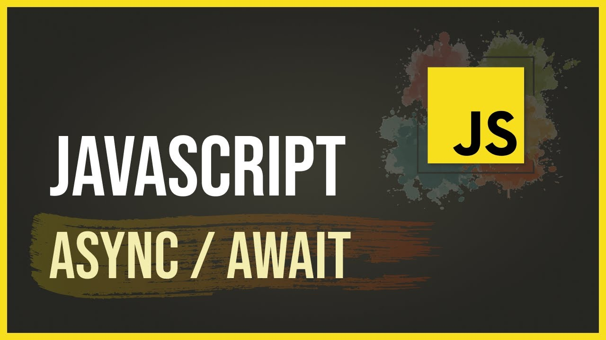
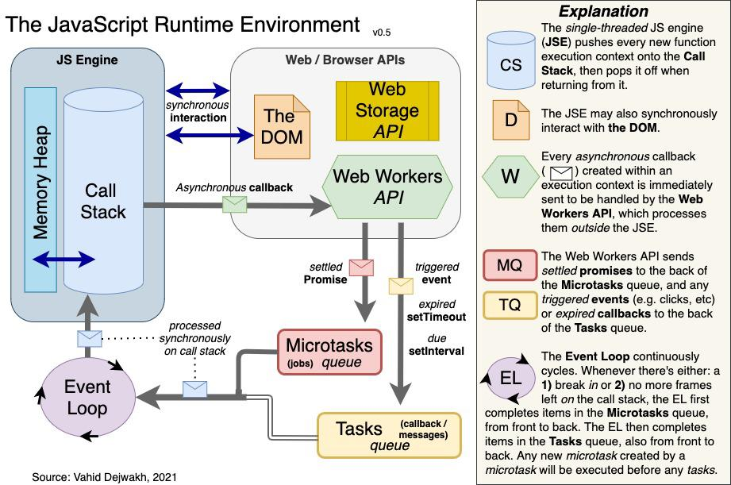

# Asynchronous-ities with iJS! 😺

  

<h3 align="center">Foreword</h3>

  Notebook detailing asynchronous functions in JavaScript and HTTP Requests.
   
  <a href="https://github.com/jgome284/async-js/issues">Report Bug</a>
  ·
  <a href="https://github.com/jgome284/async-js/issues">Request Feature</a>

 

## Table of Contents

- [Asynchronous-ities with iJS! 😺](#asynchronous-ities-with-ijs-)
  - [Table of Contents](#table-of-contents)
  - [About](#about)
  - [Setup](#setup)
  - [Prerequisites](#prerequisites)
    - [Docker](#docker)
    - [VSCode](#vscode)
  - [Getting Started](#getting-started)

## About

JavaScript is an interesting language; it's single threaded, but it's built to mimic multi-threaded-isities to free itself from blocking sequential code. It does so by pushing callbacks with promises for handling through a WebAPI. For a good introduction, checkout [this article](https://vahid.blog/post/2021-03-21-understanding-the-javascript-runtime-environment-and-dom-nodes/) and the diagram below.

  

This project provides a playground for asynchronous functions and HTTP requests in JavaScript. It includes a jupyter notebook with iJavaScript that provides several examples. iJavaScript is a Javascript kernel for the [Jupyter notebook](http://jupyter.org/). The Jupyter notebook combines the creation of rich-text documents (including equations, graphs and videos) with the execution of code in a number of programming languages. The execution of code is carried out by means of a kernel that implements the [Jupyter messaging protocol](http://jupyter-client.readthedocs.io/en/latest/messaging.html). The iJavaScript kernel executes Javascript code inside a [Node.js](https://nodejs.org/) session. And thus, it behaves as the Node.js REPL does, providing access to the Node.js standard library and to any installed [npm](https://www.npmjs.com/) modules.

## Setup

This project is setup with a Dev Container for use on Visual Studio Code. It serves as a full-featured development environment with everything needed to run JavaScript on the jupyter notebook. Dev Containers separate tools, libraries, or runtimes needed for working with a codebase. They aid in continuous integration and testing. Dev containers can be run locally or remotely, in a private or public cloud, in a variety of supporting tools and editors.

[This devcontainer](./.devcontainer/), is built IAW the [dev containers specification](https://containers.dev/implementors/spec/) and tailored for a build environment that leverages Ubuntu. Of note, the devcontainer has git for version control and several extensions installed for Visual Studio Code as development utilities for the IDE.

## Prerequisites

### Docker

To start, you need to have Docker Engine and Docker Compose on your machine. You can either:

- Install [Docker Desktop](https://www.docker.com/products/docker-desktop/) which includes both Docker Engine and Docker Compose. (Recommended ⭐)
- Install [Docker Engine](https://docs.docker.com/engine/install/binaries/) and [Docker Compose](https://docs.docker.com/compose/install/standalone/) as standalone binaries. (If it suits your fancy 🤵)

### VSCode

This devcontainer is setup for development on Visual Studio Code. You should have it installed along with the [remote development pack](https://marketplace.visualstudio.com/items?itemName=ms-vscode-remote.vscode-remote-extensionpack) to enable the IDE's devcontainers functionality.

## Getting Started

To start, open VS Code in a directory of your choice. Open the terminal and clone this repository with `git clone https://github.com/jgome284/async-js`.

Open Docker Desktop to run the Docker daemon, a background process that manages and coordinates Docker containers on your system. On VS Code, start the development container by running `Dev Containers: Rebuild and Reopen In Container` in the command palette. It can be accessed with the keyboard shortcut `ctrl + shift + P` on your keyboard.

If successful, Visual Studio will establish a remote connection to the development container. When it does, feel free to look over the examples on [async-js.ipynb](./async-js.ipynb) and create your own notebook to try working with JavaScript on your own!
